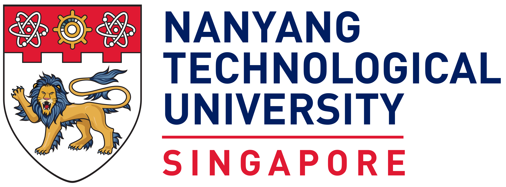
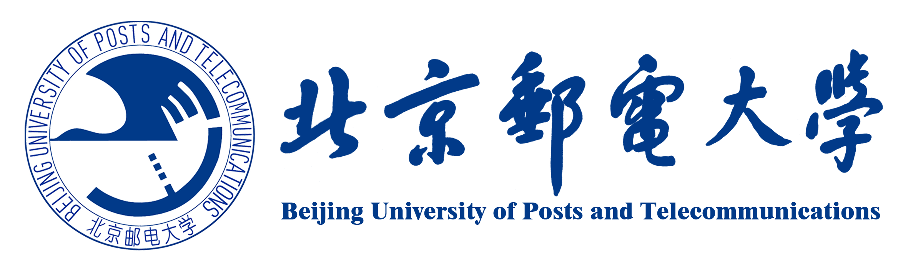
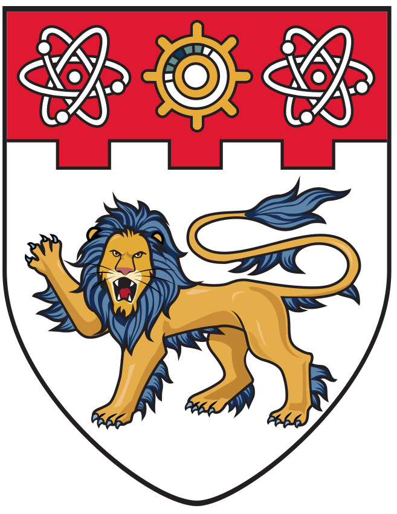
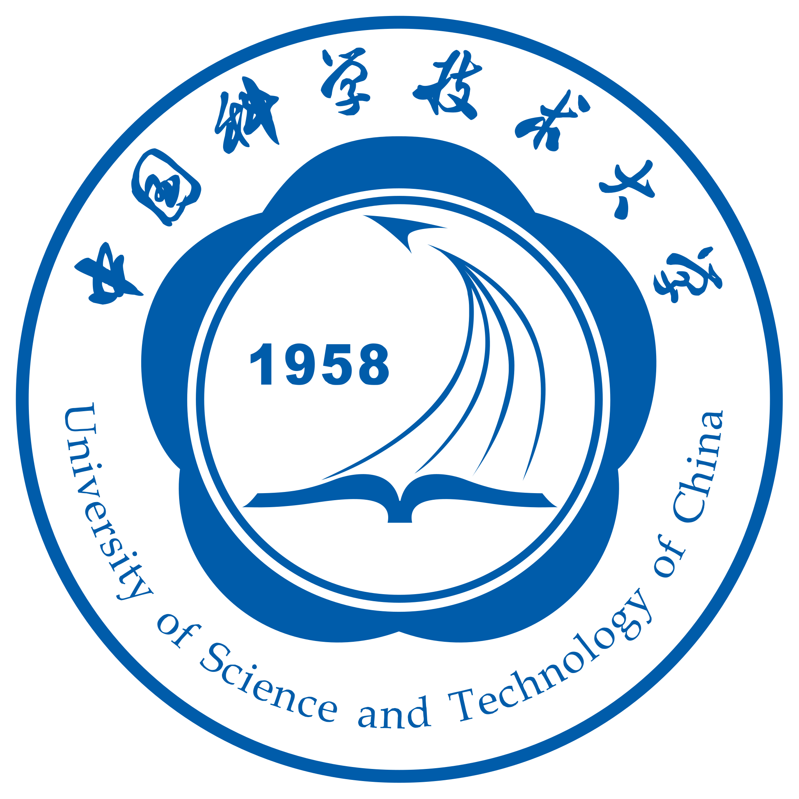

## About Me

Hi👋 I am <strong>Zherui Li (李哲睿)</strong>, an incoming PhD student at <strong style="color:#C43740;">NTU</strong>
,
collaborating with <a href="https://sites.google.com/view/wyb" style="color:#6f42c1;"><strong>Prof. Wei Yang Bryan Lim</strong></a>.
Before that, I received my BEng in Computer Science from
<strong style="color:#173984;">BUPT</strong>
.

My research focuses on building <strong style="color:#357C37;">trustworthy</strong> <strong>and</strong> <strong style="color:#408FCF;">capable</strong> <strong>AI systems</strong>, especially LLMs, agents, and multimodal models that remain reliable, aligned, and adaptable in real-world use.

<strong>I am always open to collaborations and potential opportunities. Please feel free to reach out!</strong>

<!-- <strong>🔥 I'm seeking Ph.D. opportunities for Fall 2026 or Spring 2027</strong> -->

## Research Interests

- **Trustworthy (M)LLMs:** Safety Alignment, Post-training, Realistic Failure Modes
- **Reliable Agentic Systems:** Real-world Agent Workflows, Multi-agent Systems
- **Adaptive and Controllable AI:** Model Editing, Interpretability, Continual Adaptation

<!-- ## News

- **[Feb. 2020]** Our paper about incremental learning is accepted to CVPR 2020.
- **[Feb. 2020]** We will host the ACM Multimedia Asia 2020 conference in Singapore!
- **[Sept. 2019]** Our paper about few-shot learning is accepted to NeurIPS 2019.
- **[Mar. 2019]** Our paper about few-shot learning is accepted to CVPR 2019. -->



## Experience & Education

- **[Aug. 2026 - ]** Ph.D. student in Computer Science @ [**Prof. Wei Yang Bryan Lim**](https://sites.google.com/view/wyb), NTU 
- **[Jan. 2026 - May. 2026]** Research Intern @ [**inclusionAI**](https://inclusionai.github.io/), Ant Group 
- **[May. 2025 - Jan. 2026]** Research Intern @ [**Prof. Jiaheng Zhang**](https://zjhzjh123.github.io/), NUS 
- **[Nov. 2024 - Apr. 2025]** Research Intern @ [**Prof. Xiang Wang**](https://xiangwang1223.github.io/), USTC 
- **[Jan. 2024 - Oct. 2024]** Research Intern @ [**Prof. Sen Su**](https://scholar.google.com/citations?user=JaDhAfsAAAAJ), BUPT 
- **[Sep. 2022 - Jun. 2026]** B.Eng. in Computer Science @ **School of Future**, BUPT 

<!-- ## Education

- **[Sep. 2022 - ]** B.S. in Computer Science, School of Future, BUPT  -->


